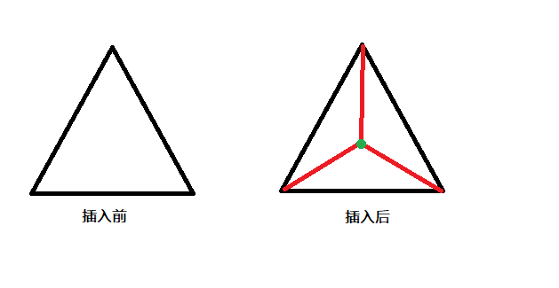

# Delaunay三角剖分
## 一、介绍
点集的三角剖分(triangulation)，对数值分析(有限元)以及图形学、点云处理来说都是极为重要的一项预处理技术。尤其是Delaunay三角剖分，关于点集的很多几何图都和Delaunay三角剖分相关，
比如Voronoi图等。

## 二、原理
### 2.1 三角剖分定义
假设V是有限点集，e为由点集V中的点作为端点构成的封闭线段，E为e的集合。点集V的三角剖分T = (V, E)就是一张图，该图满足条件：
1. 没有相交边
2. 图中所有的面都是三角面，且所有三角面的合集是点集V的凸包(convex hull)。

所谓凸包(convex hull)，就是包含点集V的最小凸多边形P，满足点集V的所有点均在P的边界上或P的内部，用CH(V)表示点集V的凸包。直观地讲，可以把V中每个点当成露在一块板外的铁钉，
那么凸包就是包围了所有铁钉的一条拉紧了的绳子构成的形状，CH(Q)中每个顶点都是Q中的点。常用的寻找点集凸包的算法有Gramham扫描法和Jarvis步进法。

### 2.2 Delaunay三角剖分定义
由三角剖分的定义可以看出，点集的三角剖分并不唯一，需要提出额外评价三角剖分好坏的标准。Delaunay三角剖分(Delaunay triangulation, 简称DT)是最常用的三角剖分，
因为它可以避免“尖锐和细长”的三角面片(最大化最小角)。“尖锐和细长”的三角面片在渲染的时候会造成“突变”的视觉效果，在有限元计算时容易因为极端值产生精度损失。下面给出Delaunay三角剖分的定义：

先定义Delaunay边：假设E中的一条边e，若e满足存在一个圆经过e的两个端点，**圆内**不含点集V中任何其他的点，这一特性又称为**空圆特性**。

定义Delaunay三角剖分：如果点集V的三角剖分T的边集E的任意元素都是Delaunay边，则称该三角剖分为Delaunay三角剖分。

### 2.3 Delaunay三角剖分属性
Delaunay三角剖分与Voronoi图互为对偶图，有一一对应关系。Voronoi图由多个Voronoi多边形组成，且每个Voronoi多边形只包含一个节点，节点和Voronoi多边形有一一对应关系。某节点对应Voronoi多边形由每个相邻节点的垂直平分线所形成的开式半平面的交集组成，
因此区域必为凸多边形(下图左)。Voronoi图的一个顶点属于三个Voronoi多边形，连接三个共点的Voronoi多边形分别对应的三个节点即Delaunay三角剖分(下图右)。


Delaunay三角剖分具有以下性质：

1. 空圆性(Empty Circle)：

    a. DT任何一张三角面的外接圆是空的，即三角面片外接圆**内部**没有其它点。 
    
    
    
    b. 在Delaunay三角剖分中，每一条边都存在一个空圆以它为弦。
    
    
    
    a和b都是空圆性的体现。
    
2. 最近邻性:任何一条连接于最近邻之间的边都会被Delaunay剖分采用(是Delaunay边)，因为存在一个以该边为直径的空圆，如下图所示。

    

    按照最近邻关系生成的图又称为最近邻图(Nearest Neighbour Graph, NNG)，它是Delaunay剖分的一个**子图**。NNG是一个有向图，最近邻关系不对等。

3. 唯一性：若不存在四点共圆、共线的情况。不论从区域何处开始构建，最终都将得到一致的结果。

4. 最大化最小角特性：在散点集可能形成的三角剖分中，Delaunay三角剖分所形成的三角形的最小角最大。从这个意义上讲，Delaunay三角网是“最接近于规则化的“的三角网。

5. 区域性：新增、删除、移动某一个顶点时只会影响临近的三角形。

6. 凸多边形的外壳：三角网最外层的边界形成一个凸多边形的外壳。


## 三、Bowyer-Watson算法
这里介绍目前主流进行DT的算法——Bowyer-Watson算法。Bowyer-Watson算法是逐点插入算法：
```
输入：点集V，输出：Delaunay三角剖分
1. 初始化一个包含所有点的矩形和一条对角线作为初始三角网络(在最后删除)。
2. 从点集V中选择点插入，并分割插入点所在的三角形。
3. 检查相邻三角形是否满足Delaunay三角网格条件，如果不满足则通过交换四边形对角线完成插入。
4. 重复2.3直至点集V所有点插入，然后删除初始化矩形网格。
```
算法step-2的图示为：


                                            
算法step-3的图示为：
  


## 四、效果

### 1. Graham扫描法寻找点集凸包(IRIS 数据集)


### 2. sklearn自带的Delaunay triangulation(IRIS数据集)


## 五、参考资料

[1][百度百科-Delaunay三角剖分](https://baike.baidu.com/item/Delaunay%E4%B8%89%E8%A7%92%E5%89%96%E5%88%86%E7%AE%97%E6%B3%95/3779918)

[2][https://github.com/lengjiayi/Delaunay-Mesh](https://github.com/lengjiayi/Delaunay-Mesh)